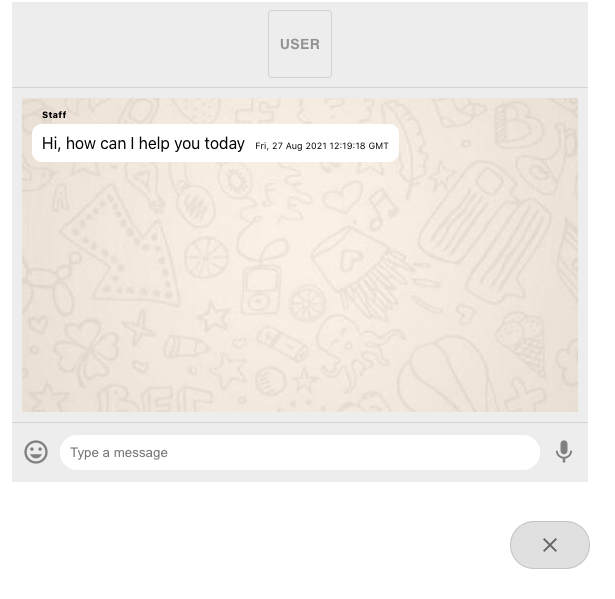

# Web Chat App

https://pensive-hawking-ee00bf.netlify.app/

## Description

The app displays a client side version of a chat app. It allows a conversation between a User and a Website staff. There is a toggle at the top of the chatbox that allows an individal to identify as a User or a Website staff. 

## Available Scripts

In the project directory, you can run:

### `npm start`

Runs the app in the development mode.\
Open [http://localhost:3000](http://localhost:3000) to view it in the browser.

